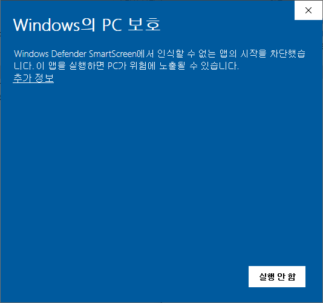
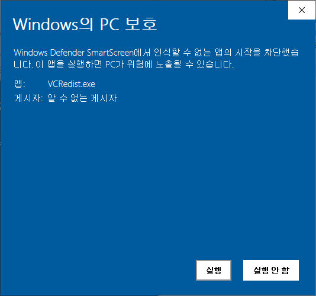
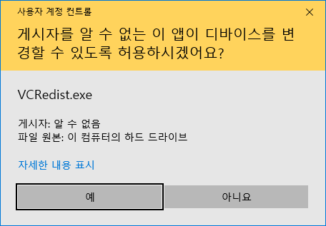
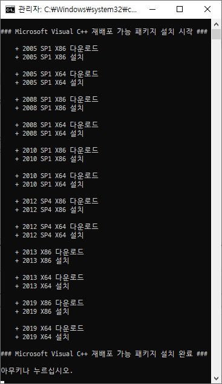
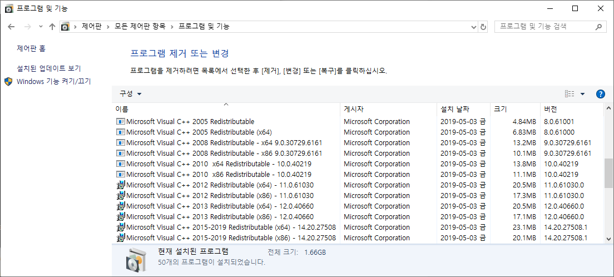

<h1> Microsoft Visual C++ 재배포 가능 패키지</h1>

2019.05.06
- 설치하려면 인터넷에 연결되어 있어야 합니다.
- 2005/2008/2010/2012/2013/2019 제품이 설치됩니다.
- 2015 이후 제품은 2019 제품만 설치됩니다.
- Windows 32비트 환경은 x86만 설치됩니다.
- Windows 64비트 환경은 x86과 x64가 설치됩니다.
- 경우에 따라 설치를 완료하려면 컴퓨터를 다시 시작해야 합니다.
- 각 제품은 최신 버전입니다.
- 상세 정보는 아래 [정보](#정보)를 참고하세요.

## 다운로드
### [VCRedist.exe](https://raw.githubusercontent.com/ssokka/Windows/master/VCRedist/VCRedist.exe)

## 참고
다운로드한 파일을 실행할 때
- `Windows의 PC 보호` 창이 나타날 경우 `추가 정보` - `실행`을 차례대로 클릭하세요.
- `사용자 계정 컨트롤` 창이 나타날 경우 `예`를 클릭하세요.

  
  
  

## 스크린샷

  
  

## 정보
### Microsoft Visual C++ 2019 재배포 가능 패키지
- Version = 14.20.27508.1
- URL = https://visualstudio.microsoft.com/ko/downloads/
- X86 = https://aka.ms/vs/16/release/vc_redist.x86.exe
- X64 = https://aka.ms/vs/16/release/vc_redist.x64.exe
### Microsoft Visual C++ 2018 재배포 가능 패키지
- Version = 14.16.27027.1
- URL = https://support.microsoft.com/ko-kr/help/2977003/the-latest-supported-visual-c-downloads
- X86 = https://aka.ms/vs/15/release/vc_redist.x86.exe
- X64 = https://aka.ms/vs/15/release/vc_redist.x64.exe
### Microsoft Visual C++ 2015 SP3 재배포 가능 패키지
- Version = 14.0.24215.1
- URL = https://www.microsoft.com/ko-kr/download/details.aspx?id=53840
- X86 = https://download.microsoft.com/download/6/a/a/6aa4edff-645b-48c5-81cc-ed5963aead48/vc_redist.x86.exe
- X64 = https://download.microsoft.com/download/6/a/a/6aa4edff-645b-48c5-81cc-ed5963aead48/vc_redist.x64.exe
### Microsoft Visual C++ 2013 재배포 가능 패키지
- Version = 12.0.40660.0
- URL = https://support.microsoft.com/ko-kr/help/3179560/update-for-visual-c-2013-and-visual-c-redistributable-package
- X86 = http://download.microsoft.com/download/f/8/d/f8d970bd-4218-49b9-b515-e6f1669d228b/vcredist_x86.exe
- X64 = http://download.microsoft.com/download/f/8/d/f8d970bd-4218-49b9-b515-e6f1669d228b/vcredist_x64.exe
### Microsoft Visual C++ 2012 SP4 재배포 가능 패키지
- Version = 11.0.61030.0
- URL = https://www.microsoft.com/ko-kr/download/details.aspx?id=30679
- X86 = https://download.microsoft.com/download/0/d/8/0d8c2d7c-75dd-409d-b70a-fdc0953343c1/vsu4/vcredist_x86.exe
- X64 = https://download.microsoft.com/download/0/d/8/0d8c2d7c-75dd-409d-b70a-fdc0953343c1/vsu4/vcredist_x64.exe
### Microsoft Visual C++ 2010 SP1 재배포 가능 패키지
- Version = 10.0.40219
- URL = https://www.microsoft.com/ko-kr/download/details.aspx?id=26999
- X86 = https://download.microsoft.com/download/1/6/5/165255e7-1014-4d0a-b094-b6a430a6bffc/vcredist_x86.exe
- X64 = https://download.microsoft.com/download/1/6/5/165255e7-1014-4d0a-b094-b6a430a6bffc/vcredist_x64.exe
### Microsoft Visual C++ 2008 SP1 재배포 가능 패키지
- Version = 9.0.30729.6161
- URL = https://www.microsoft.com/ko-kr/download/details.aspx?id=26368
- X86 = https://download.microsoft.com/download/5/d/8/5d8c65cb-c849-4025-8e95-c3966cafd8ae/vcredist_x86.exe
- X64 = https://download.microsoft.com/download/5/d/8/5d8c65cb-c849-4025-8e95-c3966cafd8ae/vcredist_x64.exe
### Microsoft Visual C++ 2005 SP1 재배포 가능 패키지
- Version = 8.0.61001
- URL = https://www.microsoft.com/ko-kr/download/details.aspx?id=26347
- X86 = https://download.microsoft.com/download/1/e/4/1e4d029e-1d34-4ca8-b269-2cfeb91bd066/vcredist_x86.exe
- X64 = https://download.microsoft.com/download/1/e/4/1e4d029e-1d34-4ca8-b269-2cfeb91bd066/vcredist_x64.exe