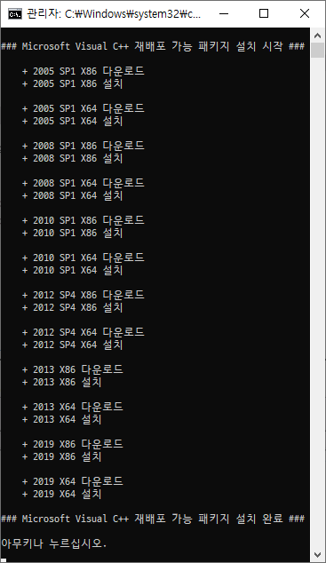

# Microsoft Visual C++ 재배포 가능 패키지
2019.05.03

## 다운로드
- [mvcr.exe](https://raw.githubusercontent.com/ssokka/windows/master/mvcr/mvcr.exe)

## 스크린샷

## 2019 14.20.27508.1
- URL = https://visualstudio.microsoft.com/ko/downloads/
- X86 = https://aka.ms/vs/16/release/vc_redist.x86.exe
- X64 = https://aka.ms/vs/16/release/vc_redist.x64.exe

## 2017 14.16.27027.1
- URL = https://support.microsoft.com/ko-kr/help/2977003/the-latest-supported-visual-c-downloads
- X86 = https://aka.ms/vs/15/release/vc_redist.x86.exe
- X64 = https://aka.ms/vs/15/release/vc_redist.x64.exe

## 2015 SP3 14.0.24215.1
- URL = https://www.microsoft.com/ko-kr/download/details.aspx?id=53840
- X86 = https://download.microsoft.com/download/6/a/a/6aa4edff-645b-48c5-81cc-ed5963aead48/vc_redist.x86.exe
- X64 = https://download.microsoft.com/download/6/a/a/6aa4edff-645b-48c5-81cc-ed5963aead48/vc_redist.x64.exe

## 2013 12.0.40660.0
- URL = https://support.microsoft.com/ko-kr/help/3179560/update-for-visual-c-2013-and-visual-c-redistributable-package
- X86 = http://download.microsoft.com/download/f/8/d/f8d970bd-4218-49b9-b515-e6f1669d228b/vcredist_x86.exe
- X64 = http://download.microsoft.com/download/f/8/d/f8d970bd-4218-49b9-b515-e6f1669d228b/vcredist_x64.exe

## 2012 SP4 11.0.61030.0
- URL = https://www.microsoft.com/ko-kr/download/details.aspx?id=30679
- X86 = https://download.microsoft.com/download/0/d/8/0d8c2d7c-75dd-409d-b70a-fdc0953343c1/vsu4/vcredist_x86.exe
- X64 = https://download.microsoft.com/download/0/d/8/0d8c2d7c-75dd-409d-b70a-fdc0953343c1/vsu4/vcredist_x64.exe

## 2010 SP1 10.0.40219
- URL = https://www.microsoft.com/ko-kr/download/details.aspx?id=26999
- X86 = https://download.microsoft.com/download/1/6/5/165255e7-1014-4d0a-b094-b6a430a6bffc/vcredist_x86.exe
- X64 = https://download.microsoft.com/download/1/6/5/165255e7-1014-4d0a-b094-b6a430a6bffc/vcredist_x64.exe

## 2008 SP1 9.0.30729.6161
- URL = https://www.microsoft.com/ko-kr/download/details.aspx?id=26368
- X86 = https://download.microsoft.com/download/5/d/8/5d8c65cb-c849-4025-8e95-c3966cafd8ae/vcredist_x86.exe
- X64 = https://download.microsoft.com/download/5/d/8/5d8c65cb-c849-4025-8e95-c3966cafd8ae/vcredist_x64.exe

## 2005 SP1 8.0.61001
- URL = https://www.microsoft.com/ko-kr/download/details.aspx?id=26347
- X86 = https://download.microsoft.com/download/1/e/4/1e4d029e-1d34-4ca8-b269-2cfeb91bd066/vcredist_x86.exe
- X64 = https://download.microsoft.com/download/1/e/4/1e4d029e-1d34-4ca8-b269-2cfeb91bd066/vcredist_x64.exe
